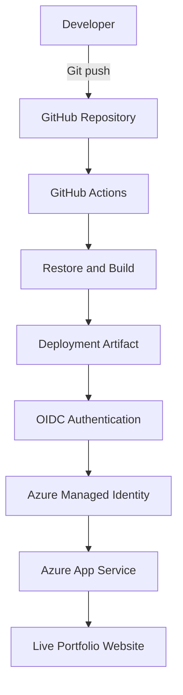

# Azure ASP.NET Portfolio with Secure CI/CD

A professional ASP.NET Core portfolio automatically built and deployed to Azure App Service using GitHub Actions and secure OpenID Connect authentication.

## Live Website

[View the live Azure portfolio](https://saikrishna-aspnet-cicd-2026-gccnf0ckexd8gjfy.centralindia-01.azurewebsites.net)

## Project Overview

This project demonstrates a complete cloud application delivery workflow:

- Developed a responsive portfolio using ASP.NET Core Razor Pages
- Stored and version-controlled the application in GitHub
- Implemented continuous integration and deployment using GitHub Actions
- Configured secretless Azure authentication using OpenID Connect
- Built and packaged the application automatically
- Deployed the generated artifact to Azure App Service
- Hosted the project cost-effectively using the Azure F1 Free tier

## Architecture

CI/CD Workflow

Every push to the main branch triggers the following process:

Checkout the source code
Configure the required .NET SDK
Restore project dependencies
Build the ASP.NET application
Publish the deployment package
Upload and download the build artifact
Authenticate to Azure using OIDC
Deploy the application to Azure App Service
Security

The pipeline uses GitHub Actions OIDC federation with a user-assigned managed identity.

This provides:

No Azure passwords stored in GitHub
No long-lived client secrets
Short-lived authentication tokens
Repository and branch-specific trust
Azure role-based access control
Technologies
Category	Technologies
Application	ASP.NET Core, Razor Pages, HTML, CSS, JavaScript
Cloud	Microsoft Azure, Azure App Service
CI/CD	GitHub Actions
Authentication	OpenID Connect, Managed Identity
Source Control	Git, GitHub
Runtime	.NET 10
Hosting Plan	Azure App Service F1 Free

Repository Structure: 

aspnet-azure-webapp/
├── .github/
│   └── workflows/
├── WebApplication3/
│   ├── Pages/
│   ├── Properties/
│   ├── wwwroot/
│   │   ├── css/
│   │   ├── images/
│   │   └── js/
│   ├── Program.cs
│   └── WebApplication3.csproj
├── WebApplication3.slnx
├── .gitignore
└── README.md

Troubleshooting Experience

During implementation, I diagnosed and resolved:

Azure App Service quota restrictions
Razor @page build errors
GitHub Actions build failures
OIDC federated-identity subject mismatch
Git non-fast-forward push rejection
Interactive rebase and merge conflict
Vim commit-message swap file
Generated bin, obj, and .vs files being tracked
Key Learning Outcomes
Building ASP.NET applications through automated workflows
Configuring Azure App Service continuous deployment
Implementing passwordless cloud authentication
Troubleshooting GitHub Actions failures
Resolving Git conflicts through rebase
Maintaining a clean and professional repository
Controlling Azure costs with the F1 Free tier
Author

Sai Krishna Vempati
Azure Cloud & DevOps Engineer

LinkedIn
GitHub
Technical Blog
Certifications
Microsoft Certified: Azure Administrator Associate — AZ-104
Microsoft Certified: DevOps Engineer Expert — AZ-400
ITIL 4 Foundation
